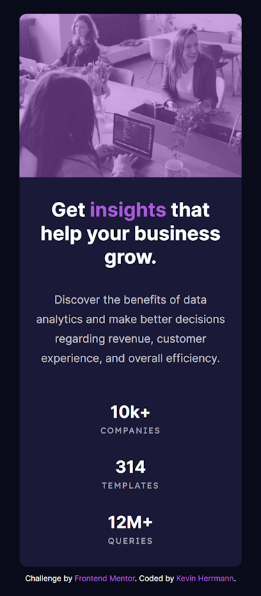
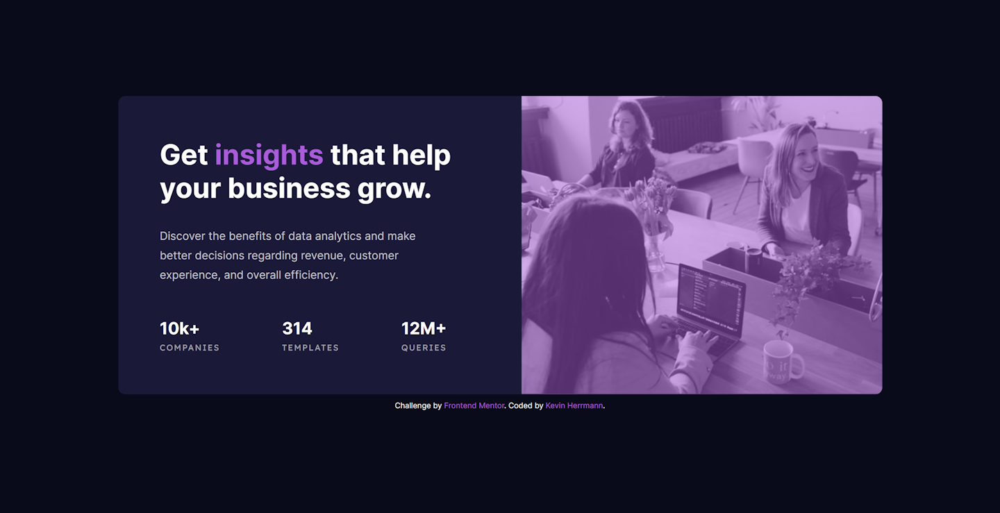

# Frontend Mentor - Stats preview card component solution

This is a solution to the [Stats preview card component challenge on Frontend Mentor](https://www.frontendmentor.io/challenges/stats-preview-card-component-8JqbgoU62). Frontend Mentor challenges help you improve your coding skills by building realistic projects. 

## Table of contents

- [Overview](#overview)
  - [The challenge](#the-challenge)
  - [Links](#links)
- [My process](#my-process)
  - [Built with](#built-with)
  - [What I learned](#what-i-learned)
  - [Continued development](#continued-development)
- [Author](#author)
- [Screenshot](#screenshot)

## Overview

### The challenge

Users should be able to:

- View the optimal layout depending on their device's screen size

### Links

- Solution URL: [https://github.com/kevinx9000/stats-preview-card-component](https://github.com/kevinx9000/stats-preview-card-component)
- Live Site URL: [https://kevinx9000.github.io/stats-preview-card-component](https://kevinx9000.github.io/stats-preview-card-component)

## My process

### Built with

- Semantic HTML5 markup
- CSS custom properties
- Flexbox
- Mobile-first workflow

### What I learned

I tried using a mobile-first workflow; still having trouble with that as it feels like going in reverse to me. 
I had some difficulty using the HTML `<picture>` tag for the first time, especially when it came to implementing the purple overlay on the image. But I used the `<picture>` tag because two separate images were provided for the mobile/desktop layout.
I still need to work on wrapping sections correctly; I think I should have made a `card-top` and `card-bottom` section, and **then** created a `div` for the underlying text; it might have helped with my alignment and sizing.

### Continued development

Need to work on responsive layouts some more.
Need to work with the picture element and overlays some more.
Need to learn use CSS Grid so that I'm not overly reliant on Flexbox; learn how to integrate the two methods.

## Author

- Frontend Mentor - [@kevinx9000](https://www.frontendmentor.io/profile/kevinx9000)
- Portfolio site - [www.kevinherrmann.quest](https://kevinherrmann.quest)

### Updates

- 10.09.23 -- Revised and refactored

## My Screenshots

